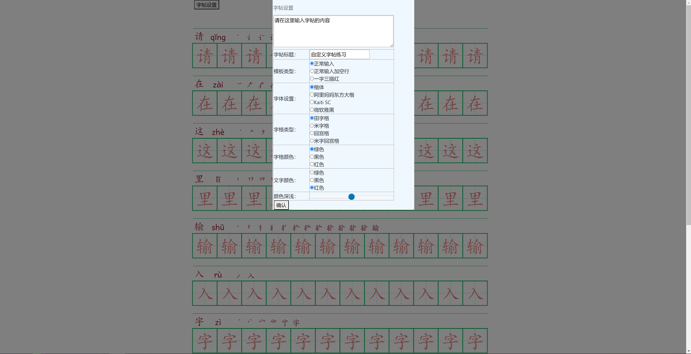
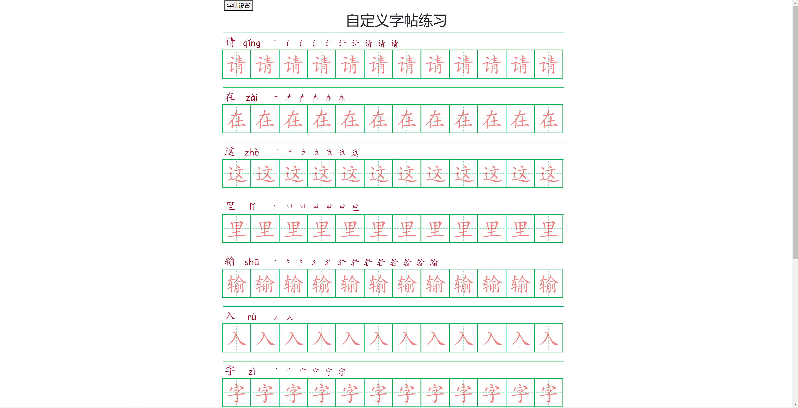
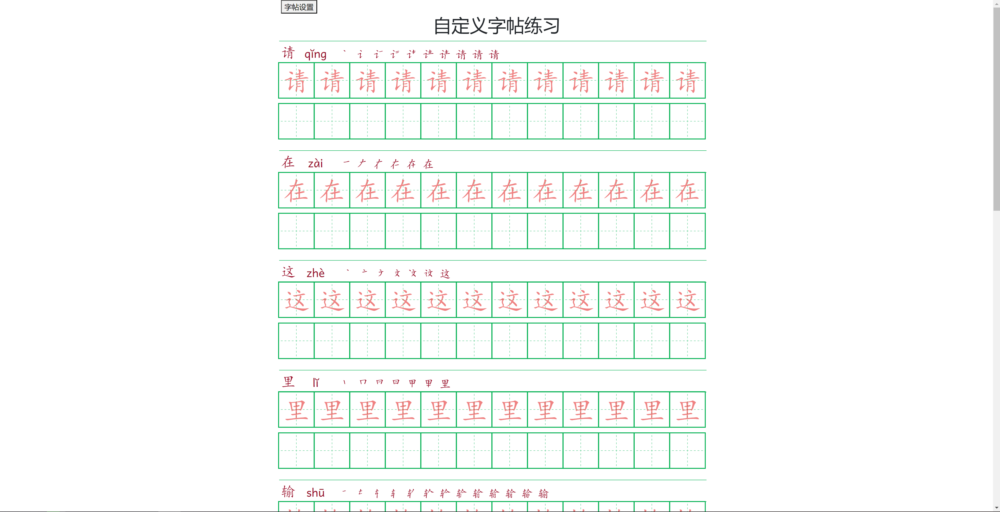
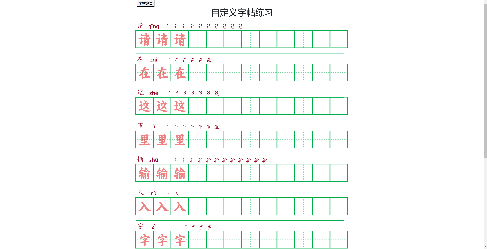
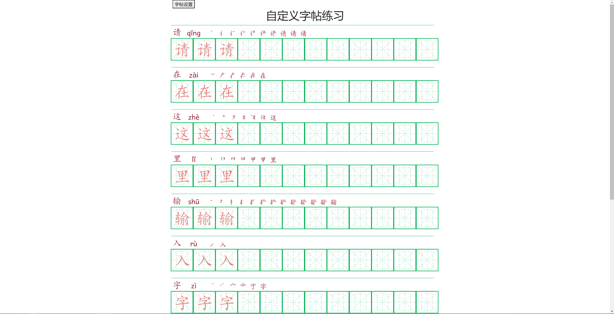
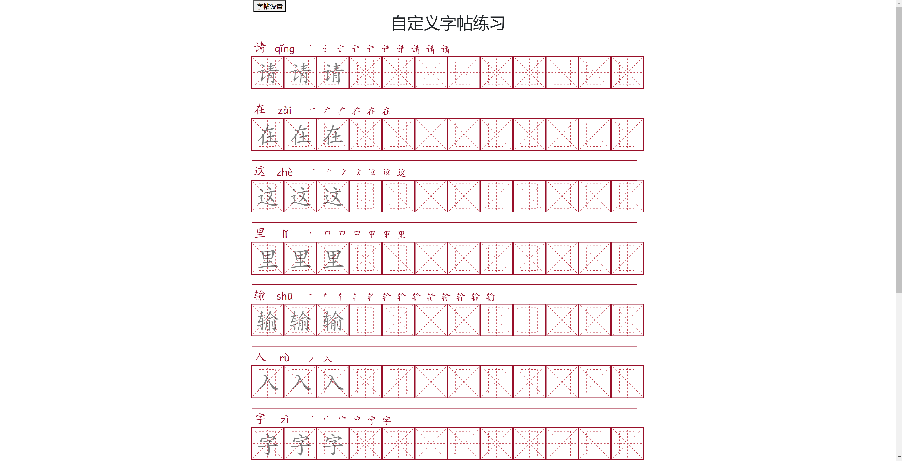
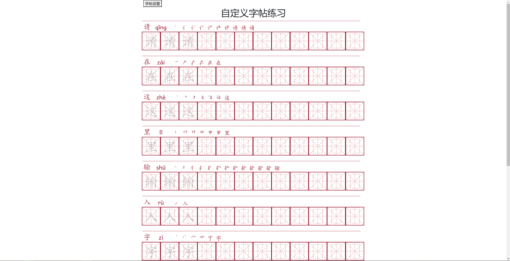
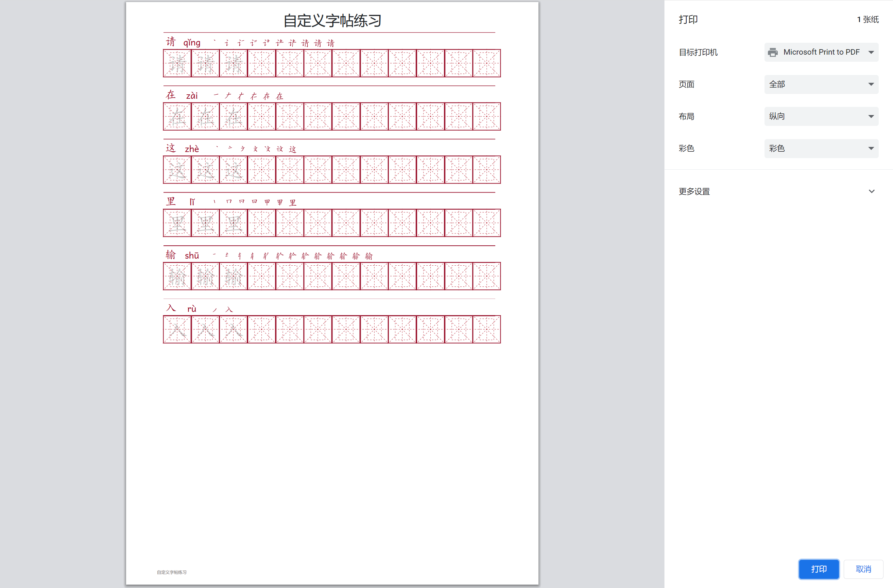

# zitie
离线字帖生成器

本仓库fork自开源仓库。

一款离线的字帖生成工具，不需要后台服务器，不需要联网，直接本地生成，小巧好用。

## 更新内容
在原仓库的基础上，更新如下：
- 修复部分笔顺重叠的问题
- 修复按钮打印的问题
- 支持字体设置
- 修复各类模式的bug

## 功能概述
### 功能设置页面

### 正常输入

### 正常输入加空行

### 一字三描红

### 设置不同字体

### 设置不同的字格类型

### 设置不同的颜色

### 设置字体颜色深浅

### 打印
